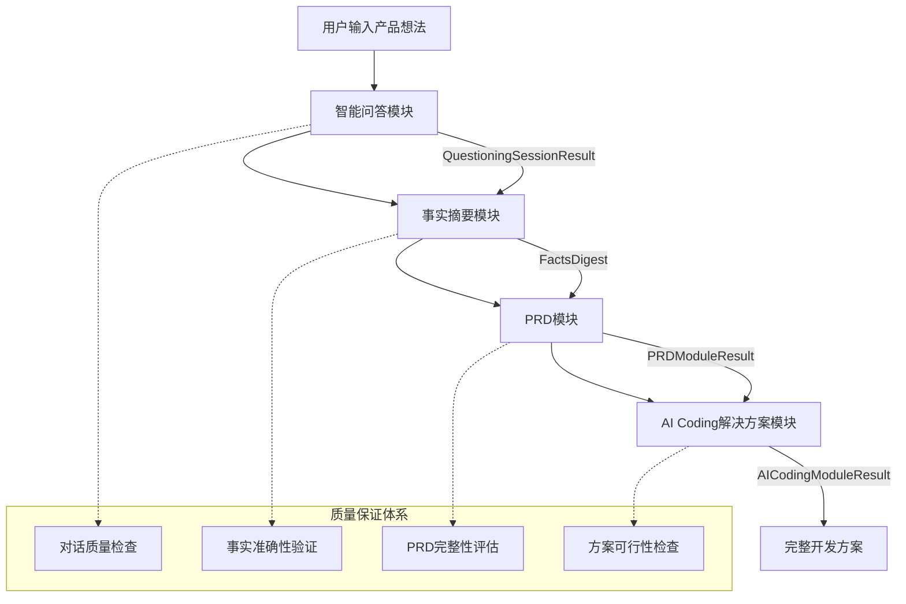

# AI产品经理 - 总体产品设计文档

## 产品概述

**AI产品经理**是一个端到端的AI驱动产品开发助手，能够将用户的产品想法自动转化为完整的开发实施方案。通过四个核心模块的协同工作，实现从需求收集到代码实现的全流程自动化。

### 核心价值主张

🎯 **双重价值闭环** - 专业PRD生成 + 完整技术实施方案
📋 **专业级PRD文档** - 自适应生成、可视化丰富、即用性强
💻 **即用型开发方案** - AI编程优化、项目模板、部署指导
🤖 **智能需求理解** - 弱化商业论证，专注功能实现和用户价值

## 系统架构

### 整体架构图



### 核心模块详解

## 📞 模块一：智能问答模块

**职责**：智能收集产品功能需求，避免冗余询问，专注实现细节

### 核心能力
- **智能分析对话历史**：避免重复询问显而易见的信息
- **功能导向问题生成**：基于PRD需求反推精准问题
- **弱化商业论证**：不询问业务背景、竞品分析、运营方案等
- **动态气泡交互**：优雅的用户体验，高效信息收集

### 关键特性
```typescript
interface QuestioningCapabilities {
  smartFollowUp: true;           // 智能追问
  contextAwareness: true;        // 上下文感知
  requirementClarification: true; // 需求澄清
  confirmationLoop: true;        // 确认循环
}
```

### 输出标准
- **QuestioningSessionResult**：完整的问答记录和需求理解
- **对话完整性评分**：≥85%才进入下一阶段
- **需求覆盖度**：确保核心需求要素完整

---

## 📋 模块二：事实摘要模块

**职责**：将对话内容结构化处理，生成标准化需求摘要

### 核心能力
- **结构化提取**：从自然语言中提取结构化信息
- **智能推导**：基于明确信息推导隐含需求
- **去重规范化**：消除重复，统一表述
- **质量验证**：确保事实准确性和完整性

### 关键特性
```typescript
interface FactsDigest {
  productDefinition: ProductDefinition;     // 产品定义
  functionalRequirements: FunctionalReq;   // 功能需求
  constraints: Constraints;                 // 约束条件
  contextualInfo: ContextualInfo;          // 上下文信息
}
```

### 输出标准
- **FactsDigest**：结构化的需求摘要
- **信息完整性**：核心要素100%覆盖
- **准确性验证**：与原始对话一致性≥95%

---

## 📄 模块三：PRD模块

**职责**：基于事实摘要生成专业级产品需求文档

### 核心能力
- **自适应生成**：根据产品类型生成差异化PRD
- **可视化丰富**：自动生成表格、流程图、原型图
- **高端原型**：TailwindCSS现代化前端原型
- **质量保证**：五维度质量评估体系

### 关键特性
```typescript
interface HighQualityPRD {
  productOverview: ProductOverview;         // 产品概述
  functionalRequirements: FunctionalReq;   // 功能需求(含表格)
  technicalSpecs: TechnicalSpecs;          // 技术规格
  uxDesign: UXDesign;                      // 用户体验设计
  acceptanceCriteria: AcceptanceCriteria;  // 验收标准
  prototypes: PrototypePages;              // 高端原型图
}
```

### 输出标准
- **专业PRD文档**：完整的产品需求文档
- **高端原型图**：TailwindCSS现代化设计，支持下载
- **质量评分**：≥80%才交付给用户
- **可视化组件**：Mermaid流程图、功能矩阵表等

---

## 💻 模块四：AI Coding解决方案模块

**职责**：生成即用型AI编程开发方案

### 核心能力
- **即用方案**：完整的项目结构和配置
- **AI编程优化**：专门为Cursor、GitHub Copilot等优化
- **渐进式开发**：分阶段实现，每阶段可运行
- **多工具兼容**：支持不同AI编程工具

### 关键特性
```typescript
interface AICodingSolution {
  projectInitialization: ProjectInit;      // 项目初始化
  developmentPlan: DevelopmentPlan;        // 开发计划
  aiInstructions: AIInstructions;          // AI编程指令
  codeTemplates: CodeTemplates;            // 代码模板
  deploymentSolution: DeploymentSolution;  // 部署方案
}
```

### 输出标准
- **完整开发方案**：从初始化到部署的全流程
- **AI编程指令集**：针对不同工具的优化指令
- **代码模板库**：可直接使用的代码模板
- **一键部署**：支持主流平台的部署方案

---

## 🔄 完整工作流程

### 1. 用户交互阶段
```
用户描述想法 → AI智能追问 → 需求澄清确认 → 形成完整理解
```

### 2. 智能分析阶段
```
对话记录 → 结构化提取 → 智能推导 → 质量验证 → 标准化输出
```

### 3. 专业设计阶段
```
需求摘要 → 自适应PRD生成 → 可视化创建 → 原型图生成 → 质量评估
```

### 4. 技术实施阶段
```
PRD文档 → 技术方案设计 → AI编程指令 → 代码模板 → 部署方案
```

## 🎯 产品优势

### 相比传统方式的优势

| 传统方式 | AI产品经理 | 优势 |
|---------|-----------|------|
| 需求收集靠人工访谈，效率低 | AI智能问答，自动追问澄清 | **10x效率提升** |
| PRD编写需要专业PM，成本高 | 自动生成专业级PRD | **专业质量零成本** |
| 技术方案需要架构师设计 | AI自动生成技术实施方案 | **技术门槛降低** |
| 原型设计需要UI设计师 | 一键生成高端TailwindCSS原型 | **设计成本节省** |
| 开发指导需要技术专家 | AI编程工具优化指令 | **开发效率提升** |

### 核心竞争力

📋 **专业PRD生成能力**
- PRD质量达到资深产品经理水平
- 自适应产品类型，差异化生成
- 丰富可视化组件和高端原型

💻 **完整技术实施方案**
- AI编程工具优化指令
- 项目初始化和架构设计
- 渐进式开发计划和部署方案

🤖 **智能需求理解**
- 弱化商业论证，专注功能实现
- 智能分析对话历史，避免重复询问
- 基于PRD需求反推精准问题

⚡ **双重价值闭环**
- PRD生成与技术方案无缝衔接
- 每个环节都有质量保证
- 从想法到实施的完整链路

## 📊 质量保证体系

### 核心质量检查机制

1. **需求理解验证**：确保对用户需求的理解准确完整
2. **PRD专业性评估**：多维度评估PRD的专业水准和实用性
3. **技术方案可行性**：验证输出方案的技术可执行性

### 质量指标体系

| 模块 | 关键指标 | 目标值 |
|------|---------|--------|
| 智能问答 | 需求理解准确性 | ≥90% |
| PRD生成 | 专业质量评分 | ≥80% |
| AI编程 | 方案可执行性 | 100% |

## 🔮 技术实现要点

### 核心技术栈
- **AI对话引擎**：基于大语言模型的智能对话
- **结构化处理**：NLP + 规则引擎的混合方案
- **可视化生成**：Mermaid + HTML/CSS自动生成
- **代码模板引擎**：基于模板的代码生成
- **质量保证引擎**：多维度自动化质量检查

### 关键算法
- **智能追问算法**：基于意图识别的问题生成
- **需求结构化算法**：实体关系抽取 + 知识图谱
- **自适应模板算法**：基于产品类型的模板选择
- **质量评估算法**：多维度加权评分模型

## 🎯 使用场景

### 目标用户群体

1. **创业者和产品经理**
   - 快速将想法转化为产品方案
   - 专业级PRD文档生成
   - 技术实施指导

2. **开发者和技术团队**
   - AI编程开发指导
   - 项目初始化和架构
   - 代码模板和最佳实践

3. **企业和组织**
   - 产品创新流程标准化
   - 降低产品开发门槛
   - 提升开发效率

### 典型使用场景

📋 **PRD生成场景**
```
产品想法：开发一个任务管理工具
→ AI智能问答收集功能需求
→ 生成专业PRD文档和高端原型
→ 输出可视化功能矩阵和用户流程
```

💻 **技术实施场景**
```
已有PRD文档：需要技术实施方案
→ 分析技术需求和复杂度
→ 生成AI编程指令和项目模板
→ 输出完整开发计划和部署方案
```

🔄 **完整开发流程**
```
想法：开发一个效率提升工具
→ 智能问答澄清功能和场景
→ 生成专业PRD和交互原型
→ 提供技术方案和AI编程指导
```

## 📈 产品价值

### 核心价值体现

📋 **PRD生成价值**
- 专业级文档：达到资深产品经理水准
- 可视化丰富：自动生成流程图、功能矩阵、原型图
- 自适应生成：根据产品类型差异化输出

💻 **技术方案价值**
- 即用型方案：完整的项目初始化和开发指导
- AI编程优化：专门针对Cursor等工具优化
- 渐进式实施：分阶段开发，每阶段可运行

⚡ **效率提升价值**
- 智能需求收集：避免重复询问，精准聚焦功能实现
- 端到端流程：从想法到技术方案的完整链路
- 质量保证：多重检查确保输出的专业性和可执行性

## 🛣️ 发展规划

### 近期目标（3个月）
- ✅ 完成四个核心模块开发
- ✅ 建立质量保证体系
- 🎯 支持5种主要产品类型
- 🎯 集成3种主流AI编程工具

### 中期目标（6个月）
- 🎯 扩展到10种产品类型
- 🎯 支持更多编程语言和框架
- 🎯 建立用户反馈和学习机制
- 🎯 开发API和集成能力

### 长期愿景（12个月）
- 🎯 成为产品开发的智能基础设施
- 🎯 建立产品知识图谱和最佳实践库
- 🎯 支持复杂企业级产品开发
- 🎯 形成产品开发的新范式

## 🏆 总结

**AI产品经理**通过AI技术实现从想法到实施的完整产品开发链路，提供专业PRD生成和AI编程解决方案两大核心价值，专注功能实现而非商业论证。

### 核心价值
1. **专业PRD生成**：自动化生成达到资深产品经理水准的需求文档
2. **AI编程方案**：提供针对Cursor等工具优化的完整技术实施方案
3. **智能需求理解**：弱化商业背景询问，专注功能需求收集
4. **双重价值闭环**：PRD与技术方案无缝衔接的完整解决方案

### 技术创新
1. **多模块协同**：四个专业模块的无缝协作
2. **AI原生设计**：充分发挥AI能力的产品架构
3. **质量保证体系**：多重质量检查机制
4. **即用型输出**：直接可执行的解决方案

**AI产品经理为产品开发提供了从需求分析到技术实施的完整工具链，让专业级产品开发变得简单高效。**
